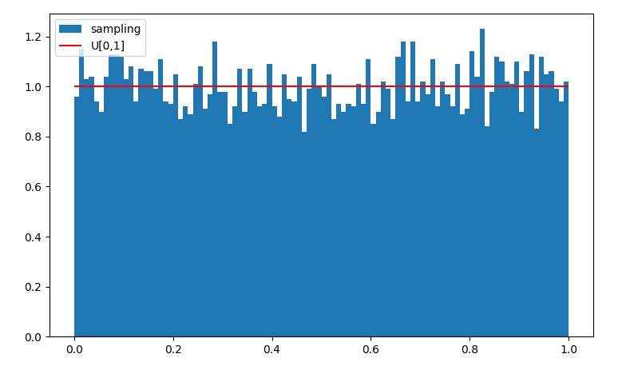
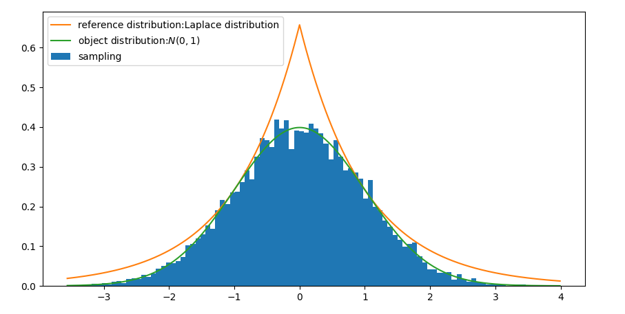

# sampling-from-distribution

通用采样算法：

- 逆变换采样
- 接受-拒绝采样
- MCMC

均匀分布采样：

- 线性同余法LCG
- LFG

指数分布、拉普拉斯分布采样：

- 逆变换采样

正太分布采样：

- Box Muller方法（正太分布）
- 修正的Box Muller方法
- 基于中心极限定理的正太分布采样
- 逆变换采样
- 接受-拒绝采样
- ziggurat
- 构造累积分布函数的可逆光滑逼近

## uniform-线性同余法

线性同余法的均匀分布采样，

## 正太分布采样

正太分布采样：

- Box Muller方法（正太分布）
- 修正的Box Muller方法
- 基于中心极限定理的正太分布采样
- 逆变换采样
- 接受-拒绝采样
- ziggurat

## 接收-拒绝采样例子

以Laplace分布作为参考分布，采样正太分布，

以均匀分布作为参考分布，采样正太分布，

持续更新中~
